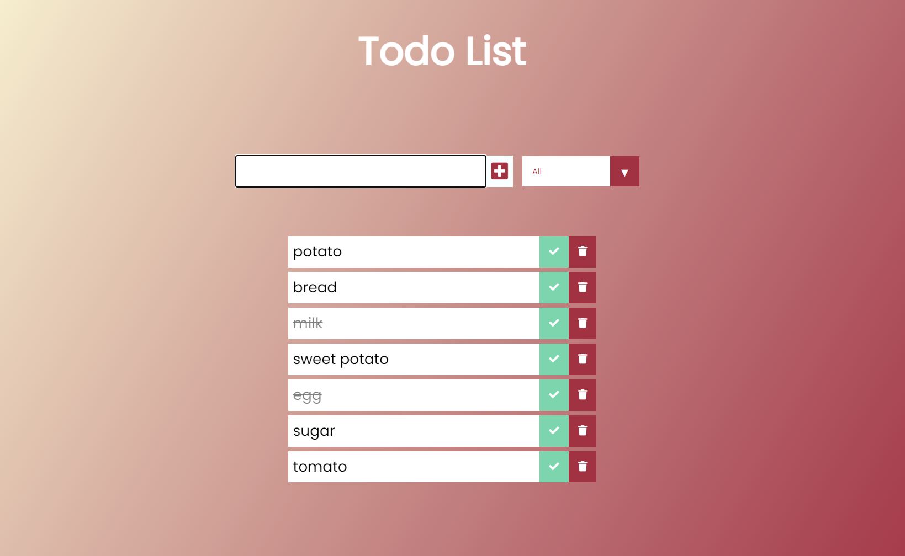

# Todo List

 Aplicación hecha en React con la básica funcionalidad "ToDo List".
 
 ## Funcionabilidad:

  - realizar un listado de tareas
  - borrar una tarea
  - marcar la tarea como completada
  - filtrar las tareas por completas o incompletas
  - guarda en el localStorage las tareas.

  

## Realizado con:
- React
- CSS 
- JavaScript
- Hooks
- localStorage

## deploy:

https://lula-zeta-todo-list-react.vercel.app/

## Pasos para instalar este proyecto
1. Clona el repositorio
$ git clone https://github.com/LulaZeta/todo_list_react.git

2. Instalación
$ npm install

3. Ejecutar el servidor de desarrollo.
$ npm start